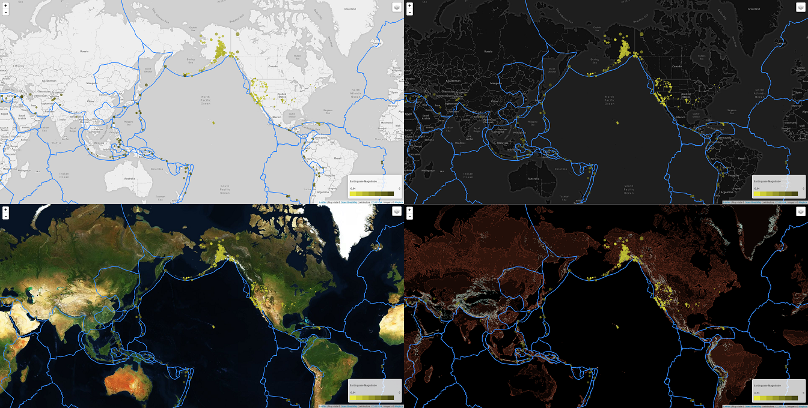

# Earthquake Map
This visualization takes data directly from the [US Geological Survey](https://earthquake.usgs.gov/ "USGS earthquake website") for the most recent week of [data](https://earthquake.usgs.gov/earthquakes/feed/v1.0/summary/all_week.geojson "Raw data") and maps it with [Leaflet](https://leafletjs.com/ "Leaflet.js website"). It is updated every time the page is loaded.
*The USGS has announced it is moving its data soon, when this happens the visualization will stop working. If you notice no data points are loading please contact the creator.*

##### [See the visualization here!](https://barrytik.github.io/Earthquake-Map/)

Every earthquake reported by the USGS is represented by a circle on the map. Higher magnitude earthquakes are darker in color and larger. There is some skewing of circle sizes near the poles due to the map projection. [Fault lines](https://raw.githubusercontent.com/fraxen/tectonicplates/master/GeoJSON/PB2002_boundaries.json "raw data containing boundaries of the fault lines") are drawn in blue.

Clicking on a circle will show the magnitude, place and time of the earthquake.

There are four layer options, Light, Dark, Sattelite and Terrain. These can be changed in the menu in the top right corner.

